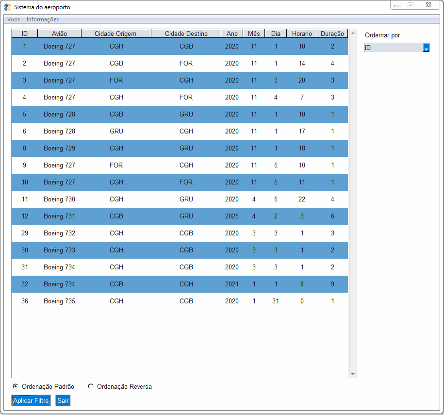
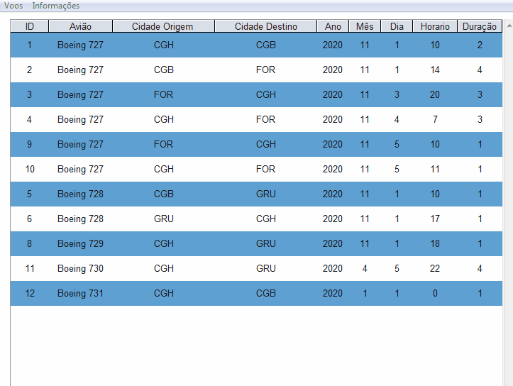
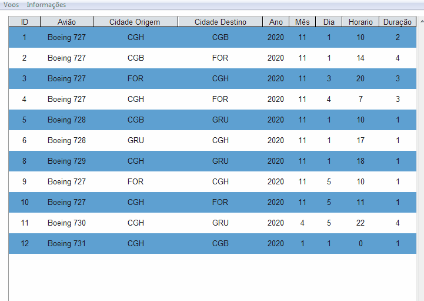

Prova NUTI - NUTI Test

Objetivo - Criar um sistema de aeroporto que se conecte a um banco de dados e que crie novos voos (Somente voos possiveis)

Goal     - Create an airport system that connects to a database and creates new flights (Only possible flights)

Feito com Python & PySimpleGUI - Made with Python & PySimpleGUI

Tela Principal - Main Screen

Tela de criação de voos- Flight creation screen

Tela de cancelamento de voos - Flight cancelation screen

Enunciado do problema:

Problema de verificação de voos

Organizar os voos de uma companhia aérea não é algo simples. Para cada possível voo deve ser verificado pelo menos a disponibilidade do avião, sua localização, horários e duração dos voos. Por ser algo complexo, precisamos de sua ajuda para criar um sistema que verifique se determinado novo voo é possível de ser realizado.

Para realizar essa verificação você pode aproveitar de um banco de dados com as seguintes tabelas (e seus respectivos atributos).
- Cidade (id, nome)
- Aviao (id, nome)
- Voo (id, idAviao, idCidadeOrigem, idCidadeDestino, data, horario, duracao em horas)

Você deve desenvolver uma interface para inserir um novo voo, selecionado um avião, uma cidade de origem, uma cidade de destino, a data e hora de partida, e a duração estimada do voo. 

O sistema deve informar se esse novo voo é válido. Para um voo ser válido, os seguintes critérios devem ser atendidos:
- o avião tem que estar na cidade de origem no dia e hora do voo
- não deve haver outro voo agendado para o mesmo avião durante a execução do novo voo
- a cidade de destino não pode ser diferente da cidade do próximo voo desse avião

A planilha em anexo contém alguns dados de voos para servir de exemplo. Com esses dados é possível adicionar um voo do avião 2, saindo da cidade 1 em qualquer dia e horário após 01/11/2020 às 18 horas. De forma contrária, não poderia ser adicionado um voo do avião 1 no dia 04/11/2020 às 11 horas a partir da cidade 2, uma vez que o avião não está nessa cidade nesse dia.
